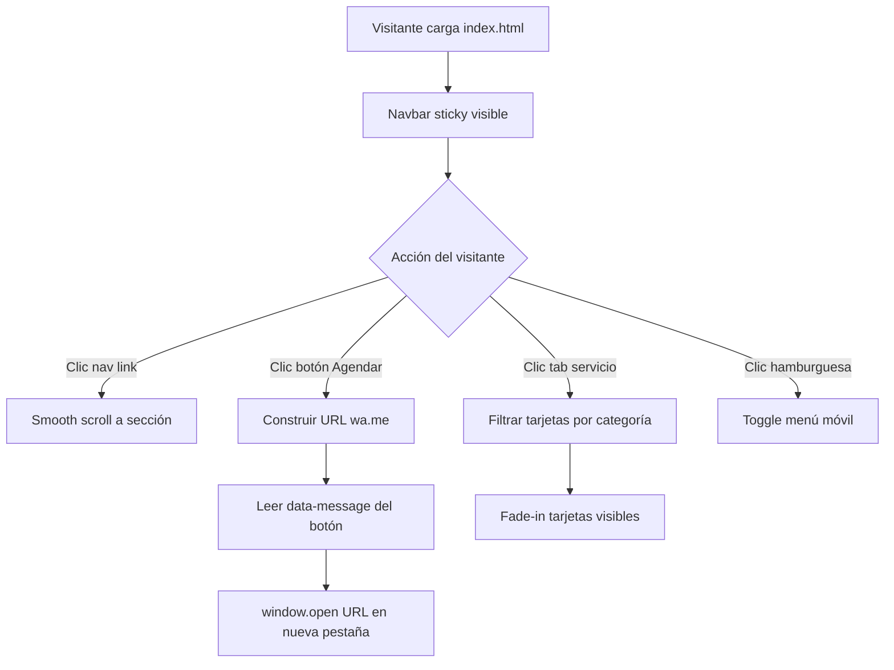

# Design Document — lg.glam_ Landing Page

## Overview

La landing page de **lg.glam_** es un archivo HTML estático único (`index.html`) que encapsula todo el CSS y JavaScript de forma embebida. El objetivo es transmitir una estética editorial de lujo mediante una paleta monocromática, tipografía geométrica en mayúsculas y fotografías desaturadas, mientras todos los puntos de conversión redirigen al usuario a WhatsApp para agendar una cita.

No existe backend, base de datos ni proceso de build. El archivo se puede servir directamente desde cualquier hosting estático (GitHub Pages, Netlify, servidor Apache/Nginx) o abrirse localmente en un navegador.

### Decisiones de diseño clave

- **Single-file**: Todo el código en `index.html` elimina dependencias de bundlers y simplifica el despliegue.
- **WhatsApp como CRM**: El número se centraliza en una variable JS para facilitar el mantenimiento.
- **Grayscale universal**: Aplicado vía CSS `filter: grayscale(100%)` en una clase reutilizable, no inline.
- **Breakpoint único**: 768 px cubre la mayoría de tablets y móviles con una sola media query.
- **Smooth scroll nativo**: `scroll-behavior: smooth` en `<html>` evita JS adicional para la navegación.
- **Arquitectura JS por responsabilidad**: El script se organiza en dos clases — `WhatsAppService` (lógica de URL) y `UIController` (interacciones DOM) — para facilitar el aislamiento en tests y el mantenimiento futuro.
- **Critical Rendering Path optimizado**: Preload de la imagen Hero y `font-display: swap` en Google Fonts para minimizar el tiempo hasta el First Contentful Paint.
- **Analítica de eventos**: Atributos `data-analytics` en botones clave para rastrear conversiones con Google Analytics 4 sin modificar la lógica de negocio.
- **Accesibilidad de teclado**: Estilo `:focus-visible` definido globalmente para mantener la estética editorial sin sacrificar la navegación por teclado.

---

## Architecture

El sitio sigue una arquitectura de **documento HTML lineal** con secciones apiladas verticalmente. No hay routing, ni componentes dinámicos, ni estado global complejo.

```
index.html
├── <head>
│   ├── Meta tags (viewport, OG)
│   ├── <link rel="preload" as="image" href="maquillaje.jpeg">   ← CRP
│   ├── Google Fonts (Montserrat) con &display=swap              ← FCP
│   └── <style> — CSS global + secciones + :focus-visible
└── <body>
    ├── <nav id="navbar">
    ├── <section id="hero">
    ├── <section id="servicios">
    ├── <section id="premium">
    ├── <section id="cta">
    ├── <section id="instagram">
    ├── <footer id="footer">
    └── <script>
        ├── CONFIG (número WA, URLs)
        ├── class WhatsAppService   ← lógica de URL pura
        └── class UIController      ← interacciones DOM
```

### Flujo de interacción



---

## Components and Interfaces

### 1. Navbar

```
[logo.jpeg]   INICIO · SERVICIOS · INSTAGRAM   [AGENDAR CITA ▶]
```

- `position: fixed; top: 0; z-index: 1000`
- Fondo blanco con `box-shadow` sutil para separación visual
- Logo: `` con altura fija `40px`
- Links: `<a href="#hero">`, `<a href="#servicios">`, `<a href="#instagram">`
- Botón AGENDAR: `<button class="btn-dark" data-message="Hola, me gustaría agendar una cita en lg.glam_">`
- Hamburguesa: `<button class="hamburger" aria-label="Abrir menú">` visible solo en móvil
- Menú móvil: `<div class="nav-mobile">` con `display: none` por defecto, toggle via JS

### 2. Hero

```
┌─────────────────────────────────────────┐
│  [maquillaje.jpeg — grayscale — overlay] │
│                                          │
│   ¡LOS MEJORES CAMBIOS DE LOOK!          │
│   Subtítulo del estudio                  │
│                                          │
│   [VER SERVICIOS]   [AGENDAR CITA]       │
└─────────────────────────────────────────┘
```

- `height: 100vh; background-size: cover; background-position: center`
- Overlay: `::before` pseudo-elemento con `background: rgba(0,0,0,0.50)`
- Contenido centrado con Flexbox (`flex-direction: column; align-items: center; justify-content: center`)
- Botón outline: `border: 2px solid #FFF; background: transparent; color: #FFF`
- Botón sólido: `background: #FFF; color: #000`

### 3. Servicios con Tabs

```
[TODOS] [MAQUILLAJE] [MANOS Y PIES] [CABELLO] [FACIALES]

┌──────────┐ ┌──────────┐ ┌──────────┐
│  imagen  │ │  imagen  │ │  imagen  │
│ SERVICIO │ │ SERVICIO │ │ SERVICIO │
│  $precio │ │  $precio │ │  $precio │
└──────────┘ └──────────┘ └──────────┘
```

- Tabs: `<button class="tab" data-filter="todos|maquillaje|manos-pies|cabello|faciales">`
- Tab activo: `background: #000; color: #FFF`
- Tarjetas: `<div class="card" data-category="maquillaje">` con `data-message` para WhatsApp
- Grid: `display: grid; grid-template-columns: repeat(3, 1fr); gap: 1.5rem`
- Fade-in: clase `.fade-in` con `animation: fadeIn 0.4s ease`
- Catálogo de servicios y asignación de imágenes:

| Categoría     | Servicio                  | Imagen                       | Precio ref. |
|---------------|---------------------------|------------------------------|-------------|
| MAQUILLAJE    | Maquillaje Social         | `maquillaje.jpeg`            | $80.000     |
| MAQUILLAJE    | Maquillaje de Novia       | `maquillaje.jpeg`            | $150.000    |
| CABELLO       | Tinte de Cabello          | `tinte.jpeg`                 | $90.000     |
| CABELLO       | Peinado Especial          | `peinado.jpeg`               | $70.000     |
| FACIALES      | Diseño de Cejas           | `cejas.jpeg`                 | $35.000     |
| FACIALES      | Extensión de Pestañas     | `pestañas.jpeg`              | $120.000    |
| MANOS Y PIES  | Tratamiento de Pedicura   | `tratamiento-de-pedicura.png`| $55.000     |

### 4. Sección Premium 50/50

```
┌──────────────────┬──────────────────┐
│                  │  SERVICIOS       │
│  peinado.jpeg    │  PREMIUM         │
│  (grayscale)     │  ─────────────── │
│                  │  Servicio  $xxx  │
│                  │  Servicio  $xxx  │
│                  │  ...             │
│                  │  [AGENDAR CITA]  │
└──────────────────┴──────────────────┘
```

- Layout: `display: grid; grid-template-columns: 1fr 1fr`
- Imagen: `object-fit: cover; min-height: 500px; width: 100%`
- Lista de precios: `display: flex; justify-content: space-between` por fila
- Fondo columna derecha: `#F5F5F5` para contraste sutil

### 5. CTA Franja

```
┌─────────────────────────────────────────┐
│  CITA DE VALORACIÓN GRATUITA            │
│  Texto secundario breve                 │
│  [AGENDAR AHORA]                        │
└─────────────────────────────────────────┘
```

- `background: #000; color: #FFF; text-align: center; padding: 4rem 2rem`
- Botón outline blanco: `border: 2px solid #FFF; background: transparent; color: #FFF`

### 6. Feed Instagram

```
┌──────┐ ┌──────┐ ┌──────┐ ┌──────┐
│  img │ │  img │ │  img │ │  img │
└──────┘ └──────┘ └──────┘ └──────┘
         [SEGUIR EN INSTAGRAM]
```

- Grid: `grid-template-columns: repeat(4, 1fr)`
- Imágenes cuadradas: `aspect-ratio: 1/1; object-fit: cover`
- Hover overlay: `::after` pseudo-elemento con ícono SVG de Instagram centrado
- Imágenes usadas: `cejas.jpeg`, `pestañas.jpeg`, `peinado.jpeg`, `tinte.jpeg`

### 7. Footer 50/50

```
┌──────────────────┬──────────────────┐
│  [logo]          │  [Google Maps]   │
│  Dirección       │  (grayscale)     │
│  Teléfono        │  pointer-events: │
│  Email           │  none            │
│  Redes sociales  │  [CÓMO LLEGAR]   │
└──────────────────┴──────────────────┘
        © 2025 lg.glam_ — Todos los derechos reservados
```

- `background: #000; color: #FFF`
- Grid: `grid-template-columns: 1fr 1fr`
- Mapa: `<iframe>` con `filter: grayscale(100%); pointer-events: none`
- Botón CÓMO LLEGAR: `<a href="https://maps.google.com/?q=..." target="_blank">`

### 8. Accesibilidad de teclado (:focus-visible)

Definido globalmente en el CSS para mantener la estética editorial sin sacrificar la navegación por teclado:

```css
/* Aplica solo cuando el usuario navega con teclado, no con mouse */
:focus-visible {
  outline: 2px solid #000;
  outline-offset: 2px;
}

/* En secciones de fondo oscuro (Hero, CTA, Footer) */
.dark-bg :focus-visible {
  outline-color: #FFF;
}
```

Todos los elementos interactivos (`<button>`, `<a>`, `.tab`, `.card`) heredan este estilo automáticamente.

### 9. Critical Rendering Path

```html
<head>
  <!-- 1. Preload imagen Hero — descarga antes que CSS/JS -->
  <link rel="preload" as="image" href="maquillaje.jpeg">

  <!-- 2. Google Fonts con display=swap — texto visible inmediatamente -->
  <link href="https://fonts.googleapis.com/css2?family=Montserrat:wght@400;600;700;900&display=swap" rel="stylesheet">
</head>
```

- `rel="preload"` instruye al navegador a descargar `maquillaje.jpeg` con alta prioridad, evitando el parpadeo blanco en el Hero.
- `&display=swap` garantiza que el texto se renderice con una fuente del sistema mientras Montserrat carga, mejorando el FCP (First Contentful Paint).

### 10. Analítica de eventos (GA4)

```html
<!-- Script de GA4 en el <head> — carga asíncrona, no bloquea render -->
<script async src="https://www.googletagmanager.com/gtag/js?id=G-XXXXXXXXXX"></script>
```

Cada botón de conversión lleva `data-analytics` con un identificador semántico:

| Botón | data-analytics |
|-------|---------------|
| Navbar — AGENDAR CITA | `whatsapp-click-navbar` |
| Hero — AGENDAR CITA | `whatsapp-click-hero` |
| Tarjeta Maquillaje Social | `whatsapp-click-maquillaje-social` |
| Tarjeta Tinte de Cabello | `whatsapp-click-tinte-cabello` |
| CTA — AGENDAR AHORA | `whatsapp-click-cta` |
| Premium — AGENDAR CITA | `whatsapp-click-premium` |

`UIController.initAnalytics()` lee el atributo y dispara `gtag('event', 'whatsapp_click', { button_id: value })` antes de abrir la URL.

---

## Data Models

No existe persistencia de datos. Los únicos "modelos" son estructuras de datos en JavaScript:

### Arquitectura del script — Separación de responsabilidades

```javascript
// Responsabilidad única: formatear y sanitizar URLs de WhatsApp
class WhatsAppService {
  constructor(number, defaultMessage) { ... }
  buildUrl(message) { ... }          // → string URL válida
  sanitize(message) { ... }          // → string sin caracteres peligrosos
}

// Responsabilidad única: manejar interacciones del DOM
class UIController {
  constructor(whatsappService) { ... }
  initTabs() { ... }                 // filtrado + fade-in
  initHamburger() { ... }            // toggle menú móvil
  initWhatsAppButtons() { ... }      // delega a WhatsAppService
  initAnalytics() { ... }            // dispara eventos GA4
}

// Punto de entrada
document.addEventListener('DOMContentLoaded', () => {
  const wa = new WhatsAppService(CONFIG.whatsappNumber, CONFIG.defaultMessage);
  const ui = new UIController(wa);
  ui.init();
});
```

Esta separación permite testear `WhatsAppService` de forma completamente aislada (sin DOM) y `UIController` con un mock de `WhatsAppService`.

### Configuración global

```javascript
const CONFIG = {
  whatsappNumber: "573XXXXXXXXX",          // número E.164 sin +
  defaultMessage: "Hola, me gustaría agendar una cita en lg.glam_",
  instagramUrl: "https://www.instagram.com/lg.glam_/",
  googleMapsUrl: "https://maps.google.com/?q=Dirección+del+estudio",
  ga4MeasurementId: "G-XXXXXXXXXX"         // ID de Google Analytics 4
};
```

### Estructura de una Tarjeta_Servicio (HTML data attributes)

```html
<div class="card"
     data-category="maquillaje"
     data-message="Hola, me interesa el servicio de Maquillaje Social"
     data-analytics="whatsapp-click-maquillaje-social">
  
  <div class="card-body">
    <h3>MAQUILLAJE SOCIAL</h3>
    <p>$80.000</p>
  </div>
</div>
```

### Estructura de Tab

```html
<button class="tab active" data-filter="todos">TODOS</button>
<button class="tab" data-filter="maquillaje">MAQUILLAJE</button>
```

---

## Correctness Properties

*A property is a characteristic or behavior that should hold true across all valid executions of a system — essentially, a formal statement about what the system should do. Properties serve as the bridge between human-readable specifications and machine-verifiable correctness guarantees.*

### Property 1: Construcción de URL de WhatsApp

*For any* botón de agendar con un atributo `data-message` no vacío, la URL construida por el handler de WhatsApp SHALL tener el formato exacto `https://wa.me/<número>?text=<mensaje_codificado>`, donde `<número>` proviene de `CONFIG.whatsappNumber` y `<mensaje_codificado>` es el valor de `data-message` pasado por `encodeURIComponent`.

**Validates: Requirements 10.2, 10.3**

---

### Property 2: Fallback de mensaje genérico

*For any* botón de agendar que NO tenga atributo `data-message` (o lo tenga vacío), la URL construida SHALL usar `CONFIG.defaultMessage` como texto del mensaje, garantizando que nunca se abra un enlace de WhatsApp con texto vacío.

**Validates: Requirements 10.4**

---

### Property 3: Filtrado de tarjetas por tab

*For any* tab seleccionado con valor `data-filter` distinto de `"todos"`, todas las tarjetas visibles en el DOM SHALL tener `data-category` igual al valor del filtro activo, y ninguna tarjeta con `data-category` diferente SHALL estar visible.

**Validates: Requirements 4.3**

---

### Property 4: Tab "TODOS" muestra todas las tarjetas

*For any* estado previo del filtro, al activar el tab con `data-filter="todos"`, todas las tarjetas del Servicios_Grid SHALL ser visibles independientemente de su `data-category`.

**Validates: Requirements 4.2, 4.3**

---

### Property 5: Unicidad del tab activo

*For any* clic en un tab, exactamente un tab SHALL tener la clase `active` al finalizar la operación — el tab recién clicado — y todos los demás tabs SHALL no tener la clase `active`.

**Validates: Requirements 4.3**

---

## Error Handling

### Imágenes no encontradas

Si una imagen referenciada no existe en el directorio, el navegador mostrará el `alt` descriptivo. No se requiere manejo adicional dado que las imágenes son activos estáticos incluidos en el mismo directorio.

### WhatsApp número no configurado

Si `CONFIG.whatsappNumber` está vacío o es `undefined`, el handler SHALL abortar la apertura de la URL y registrar un `console.warn("WhatsApp number not configured")` para facilitar el diagnóstico durante el desarrollo.

### Iframe de Google Maps bloqueado

Si el navegador bloquea el iframe (política de seguridad del contenido), el contenedor del mapa mostrará un texto de fallback: "Ver ubicación en Google Maps" con enlace directo, garantizando que el visitante siempre pueda acceder a la dirección.

### JavaScript deshabilitado

Los enlaces de navegación (`<a href="#seccion">`) y los botones de WhatsApp (`<a href="https://wa.me/...">`) deben funcionar como enlaces HTML nativos como fallback cuando JS está deshabilitado. Los tabs de servicios mostrarán todas las tarjetas por defecto.

---

## Testing Strategy

### Evaluación de PBT

Este proyecto es una landing page estática con lógica JavaScript mínima. La mayor parte del código es HTML/CSS declarativo (rendering, layout, estética), que no es adecuado para property-based testing. Sin embargo, existe lógica pura testeable en JavaScript:

- **Construcción de URL de WhatsApp**: función pura `buildWhatsAppUrl(number, message) → string`
- **Filtrado de tarjetas**: función pura `filterCards(cards, category) → Card[]`
- **Selección de tab activo**: función pura `setActiveTab(tabs, selectedTab) → Tab[]`

Estas tres funciones son candidatas a property-based testing porque su comportamiento varía con los inputs y 100 iteraciones revelarían más bugs que 2-3 ejemplos.

**Librería PBT recomendada**: [fast-check](https://github.com/dubzzz/fast-check) (JavaScript/TypeScript, ampliamente adoptada).

---

### Unit Tests (ejemplo-based)

Verifican comportamientos específicos y casos borde:

| Test | Descripción | Req. |
|------|-------------|------|
| `WhatsAppService.buildUrl` con número y mensaje válidos | Verifica formato exacto de URL | 10.2 |
| `WhatsAppService.buildUrl` sin mensaje | Usa `defaultMessage` de fallback | 10.4 |
| `WhatsAppService.buildUrl` con caracteres especiales | `encodeURIComponent` aplicado | 10.3 |
| `WhatsAppService` con número vacío | `console.warn` y retorna `null` | 10.1 |
| `UIController` — Tab "TODOS" al cargar | Todas las tarjetas visibles | 4.2 |
| `UIController` — Clic en tab "MAQUILLAJE" | Solo tarjetas de maquillaje visibles | 4.3 |
| `UIController` — Hamburguesa toggle | Menú móvil aparece/desaparece | 2.9, 2.10 |
| `UIController` — `data-analytics` disparado | `gtag` llamado con el ID correcto | — |
| `:focus-visible` presente en botones | Outline visible al navegar con Tab | — |

### Property-Based Tests

Configuración mínima: **100 iteraciones por propiedad**.

Cada test debe incluir un comentario de trazabilidad:

```javascript
// Feature: lgglam-landing-page, Property 1: Construcción de URL de WhatsApp
fc.assert(fc.property(
  fc.string({ minLength: 1 }),  // número
  fc.string({ minLength: 1 }),  // mensaje
  (number, message) => {
    const url = buildWhatsAppUrl(number, message);
    return url.startsWith(`https://wa.me/${number}?text=`);
  }
), { numRuns: 100 });
```

| Propiedad | Tag de trazabilidad |
|-----------|---------------------|
| Property 1 | `Feature: lgglam-landing-page, Property 1: Construcción de URL de WhatsApp` |
| Property 2 | `Feature: lgglam-landing-page, Property 2: Fallback de mensaje genérico` |
| Property 3 | `Feature: lgglam-landing-page, Property 3: Filtrado de tarjetas por tab` |
| Property 4 | `Feature: lgglam-landing-page, Property 4: Tab TODOS muestra todas las tarjetas` |
| Property 5 | `Feature: lgglam-landing-page, Property 5: Unicidad del tab activo` |

### Integration / Visual Tests

- Verificar que el archivo `index.html` abre correctamente en Chrome, Firefox y Safari Mobile
- Verificar layout responsivo en 375px (iPhone SE), 768px (iPad) y 1440px (escritorio)
- Verificar que los meta tags Open Graph generan previsualización correcta en WhatsApp Web (usar [opengraph.xyz](https://www.opengraph.xyz))
- Verificar que el iframe de Google Maps carga con filtro grayscale aplicado
- Verificar que todas las imágenes tienen atributo `alt` descriptivo (herramienta: axe DevTools)
- Verificar que la imagen Hero no parpadea en blanco al cargar (preload activo)
- Verificar que el texto del Hero es visible antes de que Montserrat cargue (font-display: swap)
- Verificar que navegar con la tecla Tab muestra el outline `:focus-visible` en todos los elementos interactivos
- Verificar que los eventos GA4 se disparan en el panel de depuración de Google Analytics al hacer clic en botones de agendar
